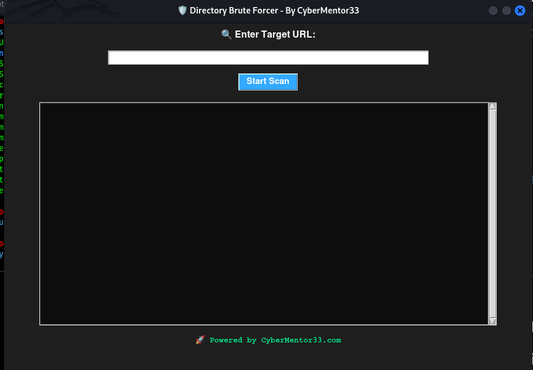

# Directory-BruteForcer-GUI
A Python-based GUI tool to brute force hidden directories on websites — with dark mode, smart HTTP response handling, and threading support. Built by CyberMentor33.com

# 🛡️ Directory Brute Forcer

A Python tool to brute force hidden directories on a target website using both CLI & GUI versions. Built with ❤️ by [CyberMentor33.com](https://cybermentor33.com)

## 🔧 Features
- GUI with dark theme
- Smart HTTP status response handling
- CLI version for terminal pros
- Fast scanning with threading

## 📸 Screenshot


## 🚀 Run GUI Version
```bash
python gui_brute_forcer.py


## 🏷️ Tags
Cybersecurity, Python Tool, Ethical Hacking, Directory Brute Forcer, Kali Linux, Penetration Testing, Bug Bounty, cybermentor33


